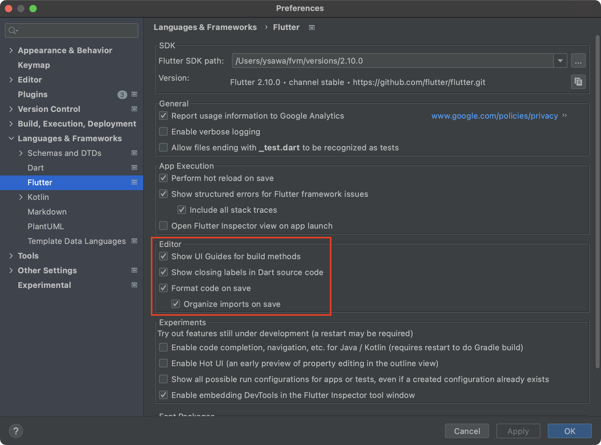

# todos

## Android Studioの設定 

Android StudioのPreferencesを開き、Flutterのメニューを選択します。
開かれた設定項目の中でEditorの欄はすべてチェックをつけましょう。



## Lint

Lintは守りましょう。編集していると、黄色い警告が出ることがあります。
この警告を無くしていきましょう。

警告を解消する際には、Android StudioのショートカットキーOption+Enterが便利です。

### 確認方法

次のコマンドで確認できます。コミット前に確認をしましょう。

```bash
flutter analyze
```

## @freezedクラス

@immutableクラスを定義するのに便利なのが、 `freezed` パッケージです。

### 更新方法

`*.dart` のプロパティを変更するなどして編集してください。
（ `*.freezed.dart` ではないので注意してください。）

そして、次のシェルコマンドを実行します。

```bash
flutter pub run build_runner build
```

### 新規作成

`todo.dart` のような命名で次のようなコードを定義します。
（ `todo.freezed.dart` という命名ではないので注意してください。）

```dart
import 'package:freezed_annotation/freezed_annotation.dart';

part 'todo.freezed.dart';

@freezed
class Todo with _$Todo {
  factory Todo(
      {required int id,
      required String description,
      required bool completed}) = _Todo;
}
```

そして、次のシェルコマンドを実行します。

```bash
flutter pub run build_runner build
```
